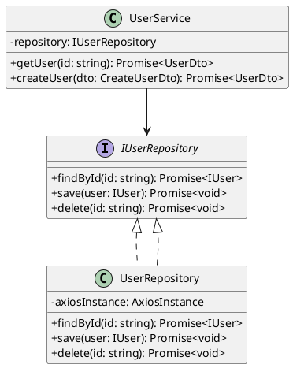
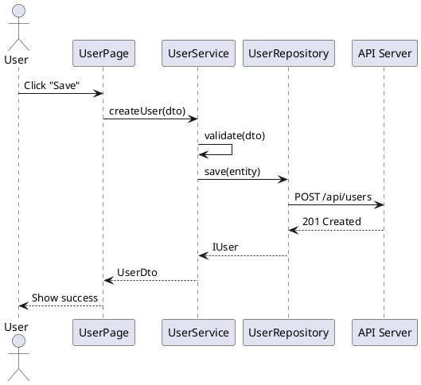
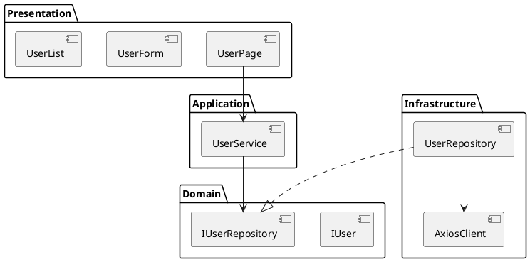

# Detail Design Workflow

## When to Create Detail Design
- New feature with complex business logic
- System integration or API design
- Database schema changes
- Architecture-level changes

## Document Structure

### 1. Overview
- Feature name and description
- Business requirements summary
- Scope and constraints

### 2. Class Diagram (PlantUML)



### 3. Sequence Diagram



### 4. Component Diagram



### 5. Data Flow

```
User Input → Component State → Redux Action → Thunk → API Call → Response → Redux Store → Component Re-render
```

## File Naming
- Place `.puml` files in `docs/designs/` directory
- Name: `[feature-name]-[diagram-type].puml`
- Example: `user-management-sequence.puml`

## Confluence Page Template
```markdown
# [Feature Name] — Detail Design

## 1. Overview
## 2. Requirements
## 3. Architecture Diagrams
## 4. Data Model
## 5. API Contracts
## 6. Error Handling
## 7. Testing Strategy
## 8. Open Questions
```
