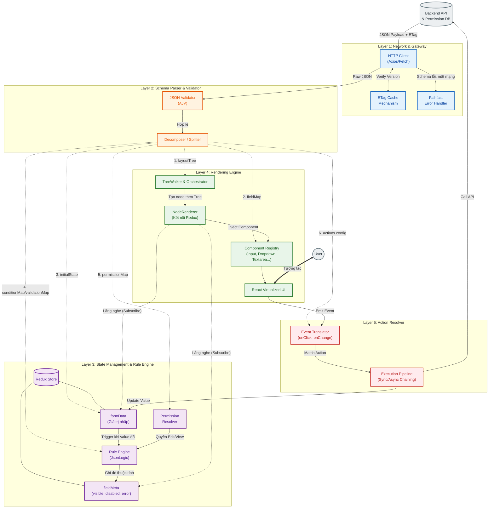

# Server-Driven UI (SDUI) Frontend - Detailed Design

Tài liệu này mô tả chi tiết luồng hoạt động (Data Flow) và vòng đời (Lifecycle) dữ liệu đi qua 5 lớp kiến trúc của hệ thống hiển thị Form động (Dynamic JSON Render).

## 1. Kiến trúc Tổng thể (Architecture Diagram)

Sơ đồ dưới đây mô tả cách nguyên liệu (JSON Schema) đi từ Backend, đi qua bộ xén/tách (Layer 2), được lưu vào kho (Layer 3), vẽ lên giao diện (Layer 4) và tương tác với người dùng (Layer 5).

## 2. Diễn giải chi tiết luồng nghiệp vụ (Data Flow)

### Giai đoạn 1: Schema Fetching & Validation (Layer 1 & 2)

1. Màn hình mở lên, **Layer 1** gọi API lên Backend lấy cấu hình JSON cho form Asset Management. Trình duyệt so sánh `ETag` (bộ đệm) xem cấu hình có thay đổi không, tránh tải dư thừa.
2. JSON thô chạy về **Layer 2**. Thư viện `AJV` nhận JSON và kiểm tra (vd: xem các type có hợp lệ không, có field bắt buộc bị thiếu không). Nếu lỗi (méo mó schema), ném `runtime error` dừng ngay chu trình.
3. Nếu hợp lệ, **Decomposer** tháo rời cục JSON thành các khối riêng biệt:
   - Một cây giao diện cơ sở (`layoutTree`) gồm các node lồng nhau (chỉ chứa ID) và một bộ từ điển (`fieldMap`) chứa cấu hình chi tiết (type, label) gửi sang **Layer 4** để dàn trang cực nhanh O(1).
   - Một map giá trị mặc định (`initialState`) báo cho **Layer 3** khởi tạo data cho Redux.
   - Các bảng quy tắc (`conditionMap`), kiểm tra lỗi (`validationMap`) và quyền hạn (`permissionMap`) nạp vào não bộ hiển thị của **Layer 3**.

### Giai đoạn 2: Khởi tạo State & Rules (Layer 3)

1. Redux Store ở **Layer 3** sinh ra hai mảng thực thể chạy song song:
   - `formData`: Toàn bộ các key rỗng `null` hoặc giá trị mặc định.
   - `fieldMeta`: Các flag hiển thị `visible`, `disabled`...
2. Ngay khi Store vừa dựng xong, **Rule Engine** bám rễ vào đó. Nó kết hợp `permissionMap` (Quyền view/edit của User lấy từ Context/API) VÀ `conditionMap` (VD: Chọn `type` mới hiện logic) để quyết định cấu hình lần vẽ đầu tiên.

### Giai đoạn 3: Dựng Layout (Layer 4)

1. **TreeWalker** duyệt qua mảng `layoutTree` từ Layer 2 truyền xuống. Cứ mỗi block (Category > SubCat > Field), nó tạo ra một `NodeRenderer`.
2. **NodeRenderer** nhận diện ID của field đó (VD: field `tags`). Nó "đăng ký" (Subscribe) thẳng vào `formData.tags` và `fieldMeta.tags` trong Store. Do áp dụng Fine-Grained, field nào đổi data field nấy mới render.
3. NodeRenderer tham chiếu qua **ComponentRegistry**, bốc đồ nghề (Input Component, Select Component...) và ấn node hiện lên UI. Nếu Node đó được khai báo bằng loại Custom (VD `location_picker`), Registry sẽ lôi tự động Component tương ứng ngoài hệ thống ra.

### Giai đoạn 4: User Interactive & Action (Layer 5)

1. Người dùng thấy Dropdown `type` và chọn `"Type C"`. Component Dropdown trên UI (Layer 4) chỉ việc hét lên _"Tôi đã bị onChange bằng value 'Type C'!"_ và không làm gì tiếp.
2. Tiếng hét đó chạy về **Layer 5 (Event Translator)**. Layer 5 soi vào map hành động, hiểu ra làm lệnh `SET_FIELD_VALUE`. Nó truyền lệnh này vào Redux Store, lúc này biến `formData.type = "Type C"`.
3. Biến `type` đổi, **Rule Engine (Layer 3)** phát hiện. Nó lục lại `conditionMap` và thấy có lệnh `showIf` của field `task` phụ thuộc vào logic này VÀ có check quyền của `tags` nữa. Nó thực hiện toán tử `and` -> ghi kết quả cuối cùng là `true` vào `fieldMeta.task.visible`.
4. Khi `fieldMeta.task.visible = true`, **NodeRenderer** gắn với trường `task` nghe thấy, nó gọi tiếp **ComponentRegistry** lấy component Select và nhồi nó ra màn hình UI.

Toàn bộ chu kỳ **L4 (Nhập) -> L5 (Dịch hành động) -> L3 (Tính toán State) -> L4 (Vẽ lại)** diễn ra trong vài phần nghìn giây và tuân thủ chặt chẽ vòng lặp dữ liệu một chiều (Unidirectional Data Flow).
